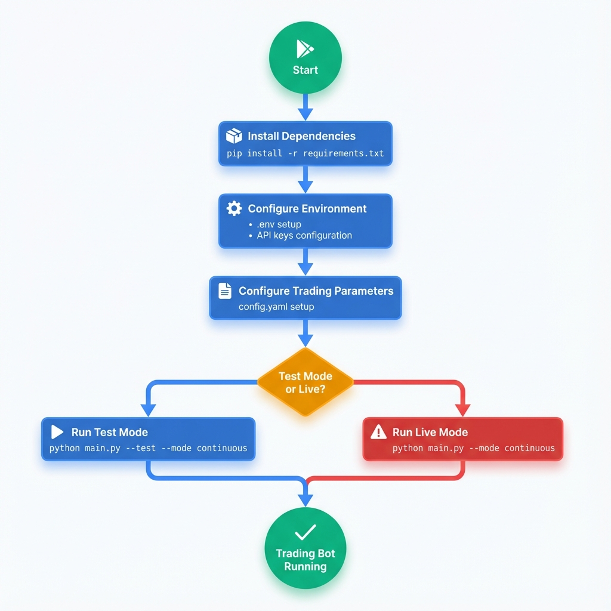
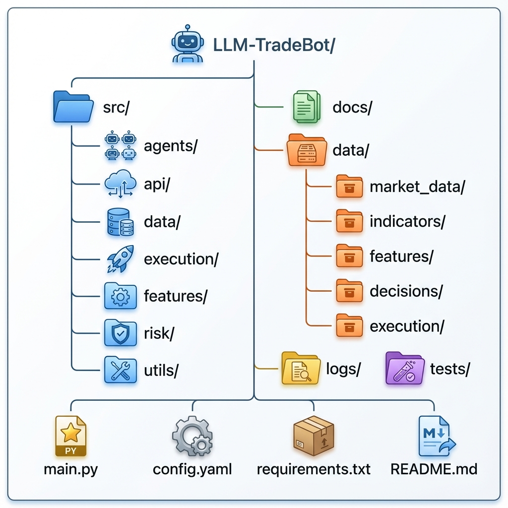
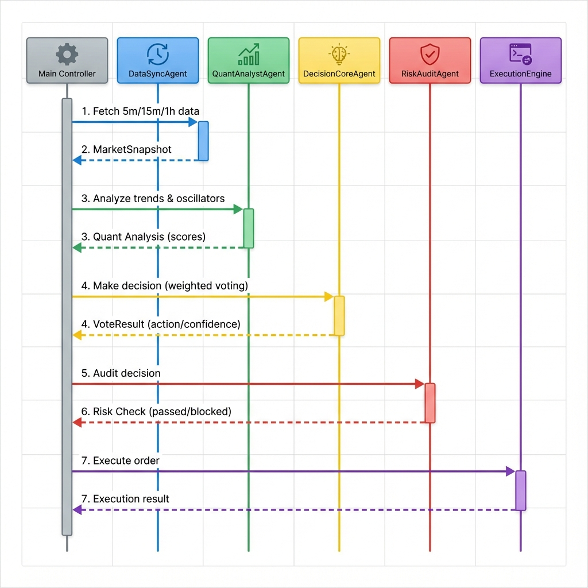
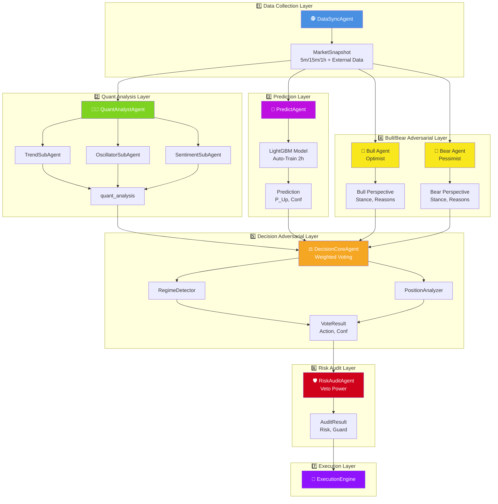

# 🤖 LLM-TradeBot

[](README.md) [](README_CN.md)


Intelligent Multi-Agent Quantitative Trading Bot based on the **Adversarial Decision Framework (ADF)**. Achieves high win rates and low drawdown in automated futures trading through market regime detection, price position awareness, dynamic score calibration, and multi-layer physical auditing.

[](https://www.python.org/)
[](LICENSE)
[](https://github.com/EthanAlgoX/LLM-TradeBot)
[](https://x.com/ethan_han999)

---

## ✨ Key Features

- 🕵️ **Perception First**: Unlike strict indicator-based systems, this framework prioritizes judging "IF we should trade" before deciding "HOW to trade".
- 🤖 **Multi-Agent Collaboration**: 8 highly specialized Agents operating independently to form an adversarial verification chain.
- ⚡ **Async Concurrency**: Currently fetches multi-timeframe data (5m/15m/1h) concurrently, ensuring data alignment at the snapshot moment.
- 🛡️ **Safety First**: Stop-loss direction correction, capital pre-rehearsal, and veto mechanisms to safeguard live trading.
- 📊 **Full-Link Auditing**: Every decision's adversarial process and confidence penalty details are recorded, achieving true "White-Box" decision-making.

---

## 🚀 Quick Start

### Startup Flow



### Detailed Steps

#### 1. Install Dependencies

```bash
pip install -r requirements.txt
```

#### 2. Configure Environment

```bash
# Copy environment variable template
cp .env.example .env

# Set API Keys
./set_api_keys.sh
```

#### 3. Configure Trading Parameters

```bash
# Copy config template
cp config.example.yaml config.yaml
```

Edit `config.yaml` to set parameters:

- Trading pair (symbol)
- Max position size (max_position_size)
- Leverage (leverage)
- Stop loss/Take profit % (stop_loss_pct, take_profit_pct)

#### 4. Start the Bot


Built-in modern real-time monitoring dashboard.

##### 🧪 Test Mode (Recommended for beginners)

Simulates trading with virtual balance ($1000). No real trades executed.

```bash
# Start with test mode
python main.py --test --mode continuous
```

##### 🔴 Live Trading Mode

⚠️ **WARNING**: Executes real trades on Binance Futures!

```bash
# Start live trading
python main.py --mode continuous
```

> **Prerequisites for Live Trading**:
>
> - Valid Binance Futures API keys configured in `.env`
> - Sufficient USDT balance in Futures wallet
> - API permissions: Read + Futures Trading enabled

After startup, visit: **<http://localhost:8000>**

**Dashboard Features**:

- **📉 Real-time K-Line**: Integrated TradingView widget, 1-minute real-time updates
- **📈 Net Value Curve**: Real-time equity tracking with initial balance baseline
- **📋 Decision Audit**: Full history of decision records, including detailed Agent scores (Strategist, Trend, Oscillator, Sentiment)
- **📜 Trade History**: Complete record of all trades with Open/Close cycles and PnL statistics
- **📡 Live Log Output**: Real-time scrolling logs with highlighted Agent tags (Oracle, Strategist, Critic, Guardian), 500-line history buffer

#### 5. Common Operations

```bash
# Stop the bot
pkill -f "python main.py"

# Restart the bot (Test Mode)
pkill -f "python main.py"; sleep 2; python main.py --test --mode continuous

# View running processes
ps aux | grep "python main.py"

# View logs in terminal (if running in background)
tail -f logs/trading_$(date +%Y%m%d).log
```

---

## 📁 Project Structure

### Directory Tree



### Directory Description

```text
LLM-TradeBot/
├── src/                    # Core Source Code
│   ├── agents/            # Multi-Agent Definitions (DataSync, Quant, Decision, Risk)
│   ├── api/               # Binance API Client
│   ├── data/              # Data Processing (processor, validator)
│   ├── execution/         # Order Execution Engine
│   ├── features/          # Feature Engineering
│   ├── monitoring/        # Monitoring & Logging
│   ├── risk/              # Risk Management
│   ├── strategy/          # LLM Decision Engine
│   └── utils/             # Utilities (DataSaver, TradeLogger, etc.)
│
├── docs/                  # Documentation
│   ├── data_flow_analysis.md          # Data Flow Analysis
│   └── *.png                          # Architecture & Flow Diagrams
│
├── data/                  # Structured Data Storage (Archived by Date)
│   ├── market_data/       # Raw K-Line Data
│   ├── indicators/        # Technical Indicators
│   ├── features/          # Feature Snapshots
│   ├── decisions/         # Final Decision Results
│   └── execution/         # Execution Records
│
├── logs/                  # System Runtime Logs
├── tests/                 # Unit Tests
├── config/                # Configuration Files
│
├── main.py                # Main Entry Point (Multi-Agent Loop)
├── config.yaml            # Trading Parameters
├── .env                   # API Key Configuration
└── requirements.txt       # Python Dependencies
```

---

## 🎯 Core Architecture

### Adversarial Multi-Agent Workflow

1. **🕵️ DataSyncAgent (The Oracle)**
    - **Role**: Unified Data Provider.
    - **Action**: Asynchronously fetches and aligns multi-timeframe K-lines (5m, 15m, 1h) and external quant data (Netflow, LSR) to ensure a consistent market snapshot.

2. **👨‍🔬 QuantAnalystAgent (The Strategist)**
    - **Role**: Signal Generator (Technical Analysis).
    - **Composition**:
        - `TrendSubAgent`: Analyzes EMA/MACD across timeframes.
        - `OscillatorSubAgent`: Detects reversal zones using RSI/Bollinger Bands.
        - `SentimentSubAgent`: Incorporates external data like Funding Rates and Open Interest.
    - **Output**: A raw comprehensive score and detailed sub-signal breakdown.

3. **🔮 PredictAgent (The Prophet)**
    - **Role**: **Future Predictor (ML Model)**.
    - **Action**:
        - Uses **LightGBM** machine learning model trained on historical data.
        - Analyzes 50+ technical features to predict price direction for the next **30 minutes**.
        - Supports auto-retraining (every 2h) to adapt to changing market conditions.
    - **Output**: Probability of price increase (P_Up) and confidence score.

4. **🐂 Bull Agent (The Optimist)**
    - **Role**: Bullish Market Advocate.
    - **Action**: Analyzes the same market data but focuses **exclusively on bullish signals**.
    - **Output**:
        - `stance`: `STRONGLY_BULLISH` / `SLIGHTLY_BULLISH` / `NEUTRAL` / `UNCERTAIN`
        - `bullish_reasons`: Key observations supporting a long position
        - `bull_confidence`: 0-100% confidence in the bullish case

5. **🐻 Bear Agent (The Pessimist)**
    - **Role**: Bearish Market Advocate.
    - **Action**: Analyzes the same market data but focuses **exclusively on bearish signals**.
    - **Output**:
        - `stance`: `STRONGLY_BEARISH` / `SLIGHTLY_BEARISH` / `NEUTRAL` / `UNCERTAIN`
        - `bearish_reasons`: Key observations supporting a short position
        - `bear_confidence`: 0-100% confidence in the bearish case

6. **⚖️ DecisionCoreAgent (The Critic)**
    - **Role**: **Adversarial Judge**.
    - **Action**:
        - **Contextualization**: Uses `RegimeDetector` to identify market state (Trending/Choppy) and `PositionAnalyzer` to locate price relative to history.
        - **Adversarial Input**: Receives **both Bull and Bear perspectives** to make balanced decisions.
        - **Integration**: Combines Strategist's technical signals with Prophet's ML predictions and Bull/Bear viewpoints.
        - **Weighted Voting**: Re-evaluates granular signals with dynamic weights adapted to the current regime.
        - **Output**: The final trading intent (Long/Short/Wait) with a confidence score.

7. **🛡️ RiskAuditAgent (The Guardian)**
    - **Role**: Risk Controller.
    - **Action**: Physically independent audit layer. Checks Max Drawdown protection, R/R requirements, and exposure limits. Has **Veto Power** to block high-risk trades regardless of high confidence.

8. **🚀 ExecutionEngine**
    - **Role**: Sniper.
    - **Action**: Precision execution within the closing seconds of the candle, handling order lifecycle and state updates.

### Collaboration Sequence



### Data Flow Architecture


**Architecture Details**:

1. **Data Collection Layer** (Blue): DataSyncAgent async concurrent collection
2. **Quant Analysis Layer** (Green): QuantAnalystAgent with 3 parallel Sub-Agents
3. **Prediction Layer** (Magenta): PredictAgent with LightGBM ML model
4. **Bull/Bear Adversarial Layer** (Yellow): 🐂 Bull Agent + 🐻 Bear Agent provide opposing perspectives
5. **Decision Adversarial Layer** (Orange): DecisionCoreAgent with regime-aware weighted voting + Bull/Bear input
6. **Risk Audit Layer** (Red): RiskAuditAgent final check and auto-correction
7. **Execution Layer** (Purple): ExecutionEngine order execution
8. **Visualization Layer**: Recent Decisions table showing full Agent data (18 columns including Bull/Bear)

#### Detailed Flowchart



> 📖 **Detailed Docs**: See [Data Flow Analysis](./docs/data_flow_analysis.md) for complete mechanisms.

---

## 📄 Full-Link Data Auditing

### Data Storage Structure


### Storage Organization

The system automatically records intermediate processes for each cycle in the `data/` directory, organized by date for easy review and debugging:

```text
data/
├── market_data/           # Raw Multi-Timeframe K-Lines
│   └── {date}/
│       ├── BTCUSDT_5m_{timestamp}.json
│       ├── BTCUSDT_5m_{timestamp}.csv
│       ├── BTCUSDT_5m_{timestamp}.parquet
│       ├── BTCUSDT_15m_{timestamp}.json
│       └── BTCUSDT_1h_{timestamp}.json
│
├── indicators/            # Full Technical Indicators DataFrames
│   └── {date}/
│       ├── BTCUSDT_5m_{snapshot_id}.parquet
│       ├── BTCUSDT_15m_{snapshot_id}.parquet
│       └── BTCUSDT_1h_{snapshot_id}.parquet
│
├── features/              # Feature Snapshots
│   └── {date}/
│       ├── BTCUSDT_5m_{snapshot_id}_v1.parquet
│       ├── BTCUSDT_15m_{snapshot_id}_v1.parquet
│       └── BTCUSDT_1h_{snapshot_id}_v1.parquet
│
├── context/               # Quant Analysis Summary
│   └── {date}/
│       └── BTCUSDT_quant_analysis_{snapshot_id}.json
│
├── llm_logs/              # LLM Input Context & Voting Process
│   └── {date}/
│       └── BTCUSDT_{snapshot_id}.md
│
├── decisions/             # Final Weighted Vote Results
│   └── {date}/
│       └── BTCUSDT_{snapshot_id}.json
│
└── execution/             # Execution Tracking
    └── {date}/
        └── BTCUSDT_{timestamp}.json
```

### Data Formats

- **JSON**: Human-readable, used for configuration and decision results
- **CSV**: High compatibility, easy for Excel import
- **Parquet**: Efficient compression, used for large-scale time-series data

---

## 🛡️ Safety Warning

⚠️ **Important Safety Measures**:

1. **API Keys**: Keep them safe, DO NOT commit to version control.
2. **Test First**: Use `--test` argument to run simulations first.
3. **Risk Control**: Set reasonable stop-loss and position limits in `config.yaml`.
4. **Minimal Permissions**: Grant only necessary Futures Trading permissions to API keys.
5. **Monitoring**: Regularly check the `logs/` directory for anomalies.

---

## 📚 Documentation Navigation

| Document | Description |
|------|------|
| [README.md](./README.md) | Project Overview & Quick Start |
| [Data Flow Analysis](./docs/data_flow_analysis.md) | Complete Data Flow Mechanisms |
| [API Key Guide](./docs/API_KEYS_GUIDE.txt) | API Key Configuration Guide |
| [Config Example](./config.example.yaml) | Trading Parameters Template |
| [Env Example](./.env.example) | Environment Variables Template |

---

## 🎉 Latest Updates

**2025-12-23**:

- ✅ **Trade History Enhanced**: Added Open/Close Cycle columns, PnL % with color indicators.
- ✅ **Net Value Curve**: Dashed initial capital baseline with centered Y-axis logic.
- ✅ **Decision Table Refactor**: Removed Active PnL column, added tooltip for Guardian block reasons.
- ✅ **Strategy Improvements**: Added `add_position` action for "buy the dip", confidence calibration rules.
- ✅ **Documentation**: Translated dashboard agent descriptions to English.

**2025-12-21**:

- ✅ **ML Model Upgrade**: Upgraded `PredictAgent` to use **LightGBM** machine learning model.
- ✅ **Auto-Training**: Implemented automatic model retraining every 2 hours to adapt to market drifts.
- ✅ **Dashboard Refinement**: Enhanced dashboard with auto-scrolling logs, robust scrollbars, and ML probability display.
- ✅ **Cycle Optimization**: Optimized decision cycle to 3 minutes for faster response.

**2025-12-20**:

- ✅ **Adversarial Decision Framework**: Introduced `PositionAnalyzer` and `RegimeDetector`.
- ✅ **Confidence Score Refactor**: Implemented dynamic confidence penalties.
- ✅ **Documentation Optimization**: Updated README to highlight adversarial architecture.
- ✅ **Project Renamed**: Officially renamed to `LLM-TradeBot`.
- ✅ **Full-Link Auditing**: Implemented complete intermediate state archiving.

---

## 🤝 Contribution

Issues and Pull Requests are welcome!

---

This project is licensed under the GNU Affero General Public License v3.0. See the [LICENSE](LICENSE) file for details.

---

**Empowered by AI, Focused on Precision, Starting a New Era of Intelligent Quant!** 🚀
