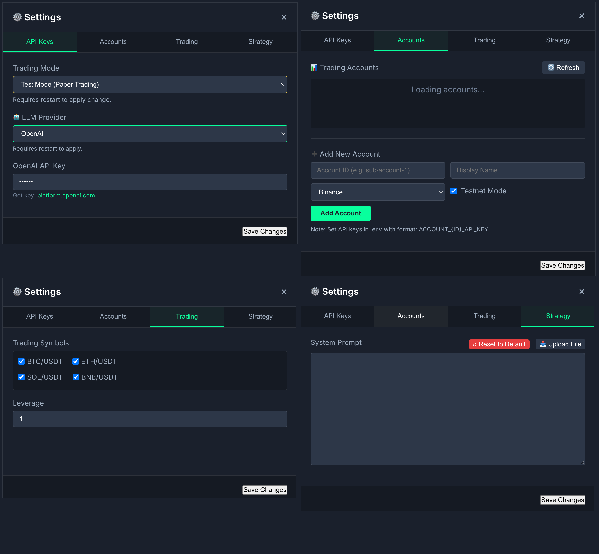
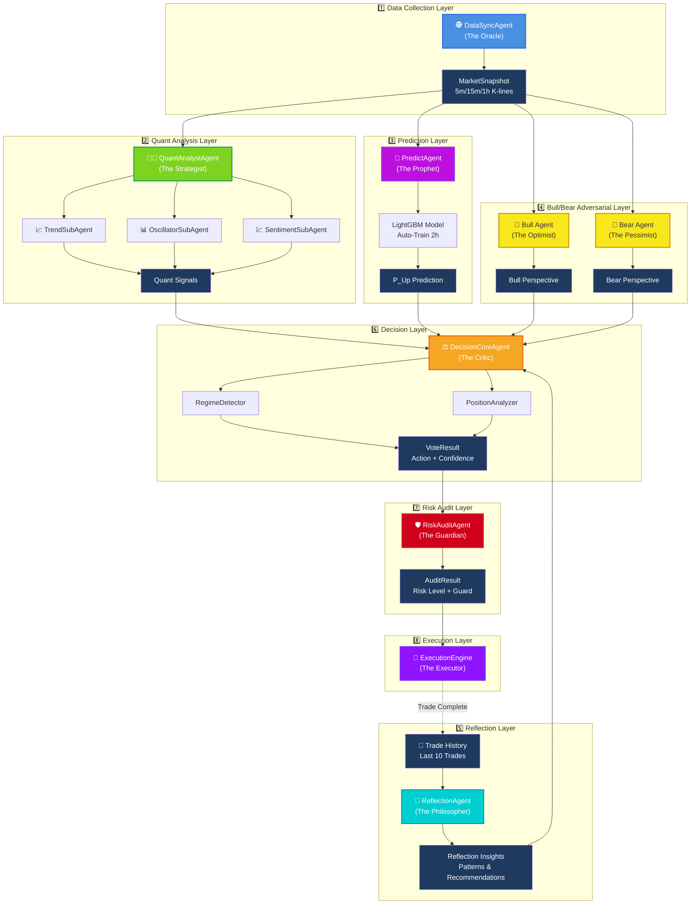

# 🤖 LLM-TradeBot

[](README.md) [](README_CN.md)


Intelligent Multi-Agent Quantitative Trading Bot based on the **Adversarial Decision Framework (ADF)**. Achieves high win rates and low drawdown in automated futures trading through market regime detection, price position awareness, dynamic score calibration, and multi-layer physical auditing.

[](https://www.python.org/)
[](LICENSE)
[](https://github.com/EthanAlgoX/LLM-TradeBot)
[](https://x.com/ethan_han999)

---

## 🌐 Web App (Recommended)

**Experience the bot immediately through our web interface:**
**[👉 Live Dashboard](https://llm-tradebot.up.railway.app/)**

---

## ✨ Key Features

- 🕵️ **Perception First**: Unlike strict indicator-based systems, this framework prioritizes judging "IF we should trade" before deciding "HOW to trade".
- 🤖 **Multi-Agent Collaboration**: 12 highly specialized Agents operating independently to form an adversarial verification chain.
- 🔝 **AUTO3 Two-Stage Symbol Selection**: Intelligent symbol selection using two-stage filtering - Stage 1 (1h backtest) filters AI500 Top10 + Majors to Top 5, Stage 2 (15m backtest) refines to Top 2.
- 🧠 **Multi-LLM Support**: Seamlessly switch between DeepSeek, OpenAI, Claude, Qwen, and Gemini via Dashboard settings.
- 📊 **Multi-Account Trading**: Manage multiple exchange accounts with unified API abstraction (currently Binance, extensible).
- ⚡ **Async Concurrency**: Currently fetches multi-timeframe data (5m/15m/1h) concurrently, ensuring data alignment at the snapshot moment.
- 🖥️ **CLI Headless Mode**: Run without Web UI for headless servers - rich terminal output with 93% less log verbosity.
- 🛡️ **Safety First**: Stop-loss direction correction, capital pre-rehearsal, and veto mechanisms to safeguard live trading.
- 📊 **Full-Link Auditing**: Every decision's adversarial process and confidence penalty details are recorded, achieving true "White-Box" decision-making.

---

## 🧪 Backtesting

**Professional-grade backtesting system** for strategy validation before live trading:


**Features**:

- 📊 **Multi-Tab Parallel Backtests**: Run up to 5 backtests simultaneously with independent configurations
- 📈 **Real-time Progress**: Live equity curve, drawdown chart, and trade markers
- 🎯 **LLM-Enhanced Mode**: Test the full multi-agent decision system including DeepSeek analysis
- 📅 **Flexible Date Ranges**: Quick presets (1/3/7/14/30 days) or custom date selection
- ⚙️ **Advanced Parameters**: Configurable leverage, stop-loss, take-profit, and trailing stops
- 📋 **Detailed Metrics**: Total return, Sharpe/Sortino ratios, win rate, max drawdown, and more
- 💾 **Full Logging**: All decisions and LLM interactions saved for analysis

**Access**: Visit `http://localhost:8000/backtest` after starting the bot.

## 🤝 Supported Ecosystem

### Supported Exchanges

#### CEX (Centralized Exchanges)

| Exchange | Status | Register (Fee Discount) |
|----------|--------|-------------------------|
| **Binance** | ✅ Supported | [Register](https://www.binance.com/join?ref=NOFXENG) |
| **Bybit** | 🗓️ Coming Soon | [Register](https://partner.bybit.com/b/83856) |
| **OKX** | 🗓️ Coming Soon | [Register](https://www.okx.com/join/1865360) |
| **Bitget** | 🗓️ Coming Soon | [Register](https://www.bitget.com/referral/register?from=referral&clacCode=c8a43172) |

#### Perp-DEX (Decentralized Perpetual Exchanges)

| Exchange | Status | Register (Fee Discount) |
|----------|--------|-------------------------|
| **Hyperliquid** | 🗓️ Coming Soon | [Register](https://app.hyperliquid.xyz/join/AITRADING) |
| **Aster DEX** | 🗓️ Coming Soon | [Register](https://www.asterdex.com/en/referral/fdfc0e) |
| **Lighter** | 🗓️ Coming Soon | [Register](https://app.lighter.xyz/?referral=68151432) |

### Supported AI Models

| AI Model | Status | Get API Key |
|----------|--------|-------------|
| **DeepSeek** | ✅ Supported | [Get API Key](https://platform.deepseek.com) |
| **Qwen** | ✅ Supported | [Get API Key](https://dashscope.console.aliyun.com) |
| **OpenAI (GPT)** | ✅ Supported | [Get API Key](https://platform.openai.com) |
| **Claude** | ✅ Supported | [Get API Key](https://console.anthropic.com) |
| **Gemini** | ✅ Supported | [Get API Key](https://aistudio.google.com) |
| **Grok** | 🗓️ Coming Soon | [Get API Key](https://console.x.ai) |
| **Kimi** | 🗓️ Coming Soon | [Get API Key](https://platform.moonshot.cn) |

---

## 📚 What You Need to Know

**For Complete Beginners**:

- This is an **automated trading bot** that trades cryptocurrency futures on Binance
- It uses AI (LLM) and machine learning to make trading decisions
- **Test mode** lets you practice with virtual money before risking real funds
- The bot runs 24/7 and makes decisions based on market analysis

**Technical Level**: Intermediate Python knowledge recommended but not required for basic usage.

---

## 🚀 Quick Start (One-Click Installation)

### 🎯 Recommended: One-Click Installation

No need to manually configure Python environment! Use our automated installation scripts:

#### Method 1: Local Installation (Development)

```bash
# 1. Clone the project
git clone <your-repo-url>
cd LLM-TradeBot

# 2. One-click install
chmod +x install.sh
./install.sh

# 3. Configure API keys
vim .env  # Edit and add your API keys

# 4. One-click start
./start.sh
```

Visit Dashboard: **<http://localhost:8000>**

#### Method 2: Docker Deployment (Production)

```bash
# 1. Clone the project
git clone <your-repo-url>
cd LLM-TradeBot

# 2. Configure environment
cp .env.example .env
vim .env  # Edit and add your API keys

# 3. One-click start
cd docker && docker-compose up -d
```

📖 **Detailed Guide**: See [QUICKSTART.md](./QUICKSTART.md)

---

### ⚙️ Prerequisites

Before you start, make sure you have:

#### For One-Click Installation (Recommended)

- ✅ **Git** installed ([Download here](https://git-scm.com/downloads))
- ✅ **Python 3.11+** OR **Docker** (installation script will check)

#### For Test Mode (Beginners)

- ✅ Nothing else needed! Test mode uses virtual balance

#### For Live Trading (Advanced)

- ✅ **Binance Account** ([Sign up here](https://www.binance.com/))
- ✅ **Binance Futures API Keys** with trading permissions
- ✅ **USDT in Futures Wallet** (minimum $100 recommended)
- ⚠️ **Risk Warning**: Only trade with money you can afford to lose

---

## 📖 Manual Installation (Advanced)

If you prefer manual setup:

### 1. Install Dependencies

```bash
pip install -r requirements.txt
```

### 2. Configure Environment

```bash
# Copy environment variable template
cp .env.example .env

# Set API Keys
./set_api_keys.sh
```

### 3. Configure Trading Parameters

```bash
# Copy config template
cp config.example.yaml config.yaml
```

Edit `config.yaml` to set parameters:

- Trading pair (symbol)
- Max position size (max_position_size)
- Leverage (leverage)
- Stop loss/Take profit % (stop_loss_pct, take_profit_pct)

#### ⚙️ Dashboard Settings

You can also configure all settings from the Dashboard:



*Settings Modal with 4 tabs: API Keys (LLM Provider), Accounts (Multi-Account), Trading, Strategy (Prompt)*

### 4. Start the Bot


Built-in modern real-time monitoring dashboard.

#### 🧪 Test Mode (Recommended for beginners)

Simulates trading with virtual balance ($1000). No real trades executed.

```bash
# Start with test mode
python main.py --test --mode continuous
```

#### 🖥️ CLI Headless Mode (For Servers)

Run the bot without Web Dashboard, perfect for headless servers or terminal-only environments.

```bash
# Basic CLI mode (manual start required)
python main.py --test --headless

# Auto-start mode (trading begins immediately)
python main.py --test --headless --auto-start

# Custom interval (1 minute cycles)
python main.py --test --headless --auto-start --interval 1
```

**Features**:

- ✅ No Web UI - runs entirely in terminal
- ✅ Rich formatted output with colors and tables
- ✅ Real-time price updates and trading decisions
- ✅ Account summary panel after each cycle
- ✅ Graceful shutdown with session statistics (Ctrl+C)
- ✅ Optimized log output (93% less verbose than Web mode)

**Output Example**:

```
╔═══════════════════════════════════════════════════════╗
║ 🤖 LLM-TradeBot CLI - TEST MODE                      ║
╚═══════════════════════════════════════════════════════╝

─────────── Cycle #1 | LINKUSDT, NEARUSDT ────────────
  🔍 Analyzing LINKUSDT...
  ✅ Data ready: $13.29
  
  ⏸️  HOLD | Confidence: 45.0%
     Reason: No clear 1h trend

╭─────────────── Account Summary ───────────────────╮
│ 💰 Equity:    $1,000.00                           │
│ 📊 Available:   $900.00                           │
│ 📈 PnL:          $0.00 (0.00%)                    │
╰───────────────────────────────────────────────────╯

  ⏳ Next cycle in 1.0 minutes...
```

#### 🚀 Simplified CLI Mode (Live Trading)

**For production live trading**, use the simplified CLI script that skips non-essential components:

```bash
# Activate virtual environment first
source venv/bin/activate

# Test mode - single run
python simple_cli.py --mode once

# Test mode - continuous (3-minute intervals)
python simple_cli.py --mode continuous --interval 3

# LIVE mode - continuous trading (⚠️ REAL MONEY)
python simple_cli.py --mode continuous --interval 3 --live

# Custom symbols (overrides .env)
python simple_cli.py --mode continuous --symbols BTCUSDT,ETHUSDT --live

# AUTO3 mode - automatic symbol selection
python simple_cli.py --mode continuous --symbols AUTO3 --live
```

**Features**:

- ✅ **Minimal footprint** - only core trading components loaded
- ✅ **Production-ready** - designed for stable 24/7 operation
- ✅ **AUTO3 support** - automatic best symbol selection via backtest
- ✅ **LLM integration** - full multi-agent decision system
- ✅ **Risk management** - built-in risk audit and position limits
- ✅ **Graceful shutdown** - Ctrl+C for clean exit

**Configuration**:

The script reads trading symbols from `.env` file by default:

```bash
# In your .env file
TRADING_SYMBOLS=BTCUSDT,ETHUSDT
# Or use AUTO3 for automatic selection
TRADING_SYMBOLS=AUTO3
```

**⚠️ Live Trading Prerequisites**:

- Valid Binance Futures API keys in `.env`
- Sufficient USDT balance in Futures wallet
- API permissions: Read + Futures Trading enabled
- DeepSeek/OpenAI API key for LLM decisions

#### 🔴 Live Trading Mode (Web Dashboard)

⚠️ **WARNING**: Executes real trades on Binance Futures!

```bash
# Start live trading
python main.py --mode continuous
```

> **Prerequisites for Live Trading**:
>
> - Valid Binance Futures API keys configured in `.env`
> - Sufficient USDT balance in Futures wallet
> - API permissions: Read + Futures Trading enabled

After startup, visit: **<http://localhost:8000>** (or use our [Cloud Hosting](https://llm-tradebot.up.railway.app/))

**Dashboard Features**:

- **📉 Real-time K-Line**: Integrated TradingView widget, 1-minute real-time updates
- **📈 Net Value Curve**: Real-time equity tracking with initial balance baseline
- **📋 Recent Decisions**: Full decision history with 17 columns showing multi-agent analysis:
  - **System**: Time, Cycle, Symbol
  - **Critic**: Result (LONG/SHORT/WAIT), Confidence, Reason
  - **Strategist**: 1h/15m/5m signals (Trend + Oscillator), Sentiment score
  - **Prophet**: ML prediction probability with direction (↗UP/➖NEU/↘DN)
  - **Bull/Bear**: Adversarial perspectives with stance (🔥Strong/↗Slight) and confidence
  - **Context**: Market Regime (📈UP/📉DN/〰️CHOP), Price Position (🔝HIGH/➖MID/🔻LOW)
  - **Guardian**: Risk level (✅SAFE/⚠️WARN/🚨DANGER), Audit result (✅PASS/⛔BLOCK), Multi-period alignment

#### 📋 Recent Decisions Indicator Guide

All indicators use semantic icons and two-line display format for quick visual scanning:

**📊 System Columns**

- **Time**: Decision timestamp
- **Cycle**: Trading cycle number
- **Symbol**: Trading pair (e.g., BTCUSDT)

**⚖️ Critic (Decision Core)**

- **Result**: Final action (LONG/SHORT/WAIT)
- **Conf**: Decision confidence (0-100%)
- **Reason**: Decision rationale (hover for full text)

**👨‍🔬 Strategist (Quant Analysis)**

- **1h/15m/5m**: Multi-timeframe signals
  - Format: `T:UP` (Trend) / `O:DN` (Oscillator)
  - Colors: Green (UP), Red (DN), Gray (NEU)
- **Sent**: Sentiment score with icon (📈/📉/➖)

**🔮 Prophet (ML Prediction)**

- Format: `🔮↗` + `65%`
- Direction: ↗UP (>55%), ➖NEU (45-55%), ↘DN (<45%)

**🐂🐻 Bull/Bear (Adversarial Analysis)**

- **Bull**: `↗Bull` / `🔥Bull` + confidence %
- **Bear**: `↘Bear` / `🔥Bear` + confidence %
- Stance: 🔥Strong, ↗Slight, ➖Neutral, ❓Unclear

**🌍 Context (Market State)**

- **Regime**: `📈UP` / `📉DN` / `〰️CHOP`
- **Position**: `🔝HIGH` / `➖MID` / `🔻LOW` + percentage

**🛡️ Guardian (Risk Control)**

- **Risk**: `✅SAFE` / `⚠️WARN` / `🚨DANGER`
- **Guard**: `✅PASS` / `⛔BLOCK` (with reason on hover)
- **Aligned**: ✅ Multi-period aligned / ➖ Not aligned

- **📜 Trade History**: Complete record of all trades with Open/Close cycles and PnL statistics
- **📡 Live Log Output**: Real-time scrolling logs with highlighted Agent tags (Oracle, Strategist, Critic, Guardian), 500-line history buffer

### 5. Common Operations

```bash
# Stop the bot
pkill -f "python main.py"

# Restart the bot (Test Mode)
pkill -f "python main.py"; sleep 2; python main.py --test --mode continuous

# View running processes
ps aux | grep "python main.py"

# View logs in terminal (if running in background)
tail -f logs/trading_$(date +%Y%m%d).log
```

---

## 📁 Project Structure

### Directory Tree


### Directory Description

```text
LLM-TradeBot/
├── src/                    # Core Source Code
│   ├── agents/            # Multi-Agent Definitions (DataSync, Quant, Decision, Risk)
│   ├── api/               # Binance API Client
│   ├── data/              # Data Processing (processor, validator)
│   ├── exchanges/         # 🆕 Multi-Account Exchange Abstraction
│   │   ├── base.py       # BaseTrader ABC + Data Models
│   │   ├── binance_trader.py  # Binance Futures Implementation
│   │   ├── factory.py    # Exchange Factory
│   │   └── account_manager.py # Multi-Account Manager
│   ├── execution/         # Order Execution Engine
│   ├── features/          # Feature Engineering
│   ├── llm/               # 🆕 Multi-LLM Interface
│   │   ├── base.py       # BaseLLMClient ABC
│   │   ├── openai_client.py  # OpenAI Implementation
│   │   ├── deepseek_client.py # DeepSeek Implementation
│   │   ├── claude_client.py  # Anthropic Claude
│   │   ├── qwen_client.py    # Alibaba Qwen
│   │   ├── gemini_client.py  # Google Gemini
│   │   └── factory.py    # LLM Factory
│   ├── monitoring/        # Monitoring & Logging
│   ├── risk/              # Risk Management
│   ├── strategy/          # LLM Decision Engine
│   └── utils/             # Utilities (DataSaver, TradeLogger, etc.)
│
├── docs/                  # Documentation
│   ├── data_flow_analysis.md          # Data Flow Analysis
│   └── *.png                          # Architecture & Flow Diagrams
│
├── data/                  # Structured Data Storage (Archived by Date)
│   ├── market_data/       # Raw K-Line Data
│   ├── indicators/        # Technical Indicators
│   ├── features/          # Feature Snapshots
│   ├── decisions/         # Final Decision Results
│   └── execution/         # Execution Records
│
├── config/                # Configuration Files
│   └── accounts.example.json  # 🆕 Multi-Account Config Template
│
├── logs/                  # System Runtime Logs
├── tests/                 # Unit Tests
│
├── main.py                # Main Entry Point (Multi-Agent Loop)
├── config.yaml            # Trading Parameters
├── .env                   # API Key Configuration
└── requirements.txt       # Python Dependencies
```

---

## 🎯 Core Architecture

### 13-Agent Collaborative Framework + Four-Layer Strategy

The system uses a **Four-Layer Strategy Filter** architecture with 13 specialized Agents collaborating to make trading decisions:

#### Symbol Selection Layer Agents

| Agent | Role | Responsibility |
|-------|------|----------------|
| **🔝 SymbolSelectorAgent** | AUTO3 Selector | Two-stage backtest selection: AI500 Top10 + Majors → Top 5 (1h) → Top 2 (15m) |

#### Data Layer Agents

| Agent | Role | Responsibility |
|-------|------|----------------|
| **🕵️ DataSyncAgent** | The Oracle | Async concurrent fetch of 5m/15m/1h K-lines, ensuring snapshot consistency |
| **👨‍🔬 QuantAnalystAgent** | The Strategist | Generates trend scores, oscillators, sentiment, and OI Fuel (Volume Proxy) |

#### Prediction Layer Agents

| Agent | Role | Responsibility |
|-------|------|----------------|
| **🔮 PredictAgent** | The Prophet | Predicts price probability using Rule-based/ML scoring |
| **🎯 RegimeDetector** | Regime Analyzer | Detects market state (Trending/Choppy) and ADX strength |
| **🤖 AIFilter** | AI Validator | AI-Trend alignment verification with veto power |

#### Semantic Analysis Layer Agents (LLM Context Generation)

| Agent | Role | Responsibility |
|-------|------|----------------|
| **📈 TrendAgent** | Trend Summarizer | Generates trend semantic analysis (UPTREND/DOWNTREND) |
| **📊 SetupAgent** | Setup Analyzer | Generates entry zone analysis (PULLBACK_ZONE/OVERBOUGHT) |
| **⚡ TriggerAgent** | Trigger Reporter | Generates trigger signal analysis (CONFIRMED/WAITING) |

#### Decision & Execution Layer Agents

| Agent | Role | Responsibility |
|-------|------|----------------|
| **🧠 StrategyEngine** | LLM Decision | DeepSeek LLM Bull/Bear debate decision engine |
| **👮 RiskAuditAgent** | The Guardian | Risk audit with absolute veto power |
| **🧠 ReflectionAgent** | The Philosopher | Trade reflection, provides historical lessons to LLM |
| **🚀 ExecutionEngine** | The Executor | Precision order execution and state management |

### Four-Layer Strategy Filter

```text
Layer 1: Trend + Fuel (1h EMA + Volume Proxy)
    ↓ PASS/FAIL
Layer 2: AI Filter (PredictAgent direction alignment)
    ↓ PASS/VETO
Layer 3: Setup (15m KDJ + Bollinger Bands entry zone)
    ↓ READY/WAIT
Layer 4: Trigger (5m Pattern + RVOL volume confirmation)
    ↓ CONFIRMED/WAITING
    ↓
🧠 LLM Decision (DeepSeek Bull/Bear Debate)
    ↓
👮 Risk Audit (Veto Power)
    ↓
🚀 Execution
```

### Data Flow Architecture


**Architecture Details**:

#### Detailed Flowchart


<details>
<summary>📐 Mermaid Diagram (Interactive)</summary>



</details>

> 📖 **Detailed Docs**: See [Data Flow Analysis](./docs/data_flow_analysis.md) for complete mechanisms.

---

## 📄 Full-Link Data Auditing

### Data Storage Structure


### Storage Organization

The system automatically records intermediate processes for each cycle in the `data/` directory, organized by date for easy review and debugging:

```text
data/
├── market_data/           # Raw Multi-Timeframe K-Lines
│   └── {date}/
│       ├── BTCUSDT_5m_{timestamp}.json
│       ├── BTCUSDT_5m_{timestamp}.csv
│       ├── BTCUSDT_5m_{timestamp}.parquet
│       ├── BTCUSDT_15m_{timestamp}.json
│       └── BTCUSDT_1h_{timestamp}.json
│
├── indicators/            # Full Technical Indicators DataFrames
│   └── {date}/
│       ├── BTCUSDT_5m_{snapshot_id}.parquet
│       ├── BTCUSDT_15m_{snapshot_id}.parquet
│       └── BTCUSDT_1h_{snapshot_id}.parquet
│
├── features/              # Feature Snapshots
│   └── {date}/
│       ├── BTCUSDT_5m_{snapshot_id}_v1.parquet
│       ├── BTCUSDT_15m_{snapshot_id}_v1.parquet
│       └── BTCUSDT_1h_{snapshot_id}_v1.parquet
│
├── context/               # Quant Analysis Summary
│   └── {date}/
│       └── BTCUSDT_quant_analysis_{snapshot_id}.json
│
├── llm_logs/              # LLM Input Context & Voting Process
│   └── {date}/
│       └── BTCUSDT_{snapshot_id}.md
│
├── decisions/             # Final Weighted Vote Results
│   └── {date}/
│       └── BTCUSDT_{snapshot_id}.json
│
└── execution/             # Execution Tracking
    └── {date}/
        └── BTCUSDT_{timestamp}.json
```

### Data Formats

- **JSON**: Human-readable, used for configuration and decision results
- **CSV**: High compatibility, easy for Excel import
- **Parquet**: Efficient compression, used for large-scale time-series data

---

## 🛡️ Safety Warning

⚠️ **Important Safety Measures**:

1. **API Keys**: Keep them safe, DO NOT commit to version control.
2. **Test First**: Use `--test` argument to run simulations first.
3. **Risk Control**: Set reasonable stop-loss and position limits in `config.yaml`.
4. **Minimal Permissions**: Grant only necessary Futures Trading permissions to API keys.
5. **Monitoring**: Regularly check the `logs/` directory for anomalies.

---

## 📚 Documentation Navigation

| Document | Description |
|------|------|
| [README.md](./README.md) | Project Overview & Quick Start |
| [Data Flow Analysis](./docs/data_flow_analysis.md) | Complete Data Flow Mechanisms |
| [API Key Guide](./docs/API_KEYS_GUIDE.txt) | API Key Configuration Guide |
| [Config Example](./config.example.yaml) | Trading Parameters Template |
| [Env Example](./.env.example) | Environment Variables Template |

---

## 🎉 Latest Updates

**2026-01-07**:

- ✅ **AUTO3 Two-Stage Symbol Selection**: Enhanced `SymbolSelectorAgent` with two-stage filtering.
  - **Stage 1 (Coarse Filter)**: 1h backtest on AI500 Top10 + Major coins (~16 symbols) → Top 5
  - **Stage 2 (Fine Filter)**: 15m backtest on Top 5 → Top 2 performers
  - Expanded candidate pool: AI500 (30+ AI/Data coins) + Majors (BTC, ETH, SOL, BNB, XRP, DOGE)
  - Auto-refresh every 6 hours with smart caching
- ✅ **BacktestAgentRunner Parity**: Full consistency between backtest and live trading environments.
  - Risk Audit Agent integrated into backtest flow
  - Four-Layer Strategy Filter applied in backtests
  - Position analysis and regime detection enabled
- ✅ **Enhanced Backtest CLI**: `python backtest.py` with support for:
  - Multi-symbol backtesting
  - Agent strategy mode (`--strategy-mode agent`)
  - LLM enhancement option (`--use-llm`)
  - Detailed HTML reports with equity curves

**2025-12-31**:

- ✅ **Full Chinese Internationalization (i18n)**: Complete bilingual support with language toggle button.
  - Dashboard UI elements (headers, tables, buttons) fully translated
  - Agent documentation sidebar with Chinese descriptions
  - Seamless language switching without page reload

**2025-12-28**:

- ✅ **Dashboard Log Mode Toggle**: Switch between Simplified (agent summaries) and Detailed (full debug) log views.
- ✅ **Net Value Curve Enhancement**: Smart x-axis labels that adapt to data volume while preserving first cycle timestamp.

**2025-12-25**:

- ✅ **ReflectionAgent (The Philosopher)**: New agent that analyzes every 10 trades and provides insights to improve future decisions.
- ✅ **Trading Retrospection**: Automatic pattern detection, confidence calibration, and actionable recommendations.
- ✅ **Decision Integration**: Reflection insights are injected into Decision Agent prompts for continuous learning.

**2025-12-24**:

- ✅ **Multi-LLM Support**: Added support for 5 LLM providers (DeepSeek, OpenAI, Claude, Qwen, Gemini) with unified interface.
- ✅ **Dashboard LLM Settings**: Switch LLM provider and API keys directly from Dashboard Settings.
- ✅ **Multi-Account Architecture**: New `src/exchanges/` module with `BaseTrader` abstraction for multi-exchange support.
- ✅ **Account Manager**: Manage multiple trading accounts via Dashboard or `config/accounts.json`.

**2025-12-21**:

- ✅ **ML Model Upgrade**: Upgraded `PredictAgent` to use **LightGBM** machine learning model.
- ✅ **Auto-Training**: Implemented automatic model retraining every 2 hours to adapt to market drifts.
- ✅ **Dashboard Refinement**: Enhanced dashboard with auto-scrolling logs, robust scrollbars, and ML probability display.

**2025-12-20**:

- ✅ **Adversarial Decision Framework**: Introduced `PositionAnalyzer` and `RegimeDetector`.
- ✅ **Confidence Score Refactor**: Implemented dynamic confidence penalties.
- ✅ **Full-Link Auditing**: Implemented complete intermediate state archiving.

---

## ❓ Frequently Asked Questions (FAQ)

### For Beginners

**Q: Is this safe to use? Will I lose money?**
A: Test mode is 100% safe - it uses virtual money. For live trading, only use funds you can afford to lose. Cryptocurrency trading is risky.

**Q: Do I need to know Python to use this?**
A: No! Just follow the Quick Start guide. You only need Python installed, not programming knowledge.

**Q: How much money do I need to start?**
A: Test mode is free. For live trading, minimum $100 USDT recommended, but start small while learning.

**Q: Will the bot trade 24/7?**
A: Yes, once started in continuous mode, it runs non-stop analyzing markets and making decisions.

**Q: How do I know if it's working?**
A: Open `http://localhost:8000` in your browser to see the real-time dashboard with live logs and charts.

### Technical Questions

**Q: Which exchanges are supported?**
A: Currently only Binance Futures. Spot trading and other exchanges are not supported.

**Q: Can I customize the trading strategy?**
A: Yes! Edit `config.yaml` for basic parameters. Advanced users can modify agent logic in `src/` directory.

**Q: What's the difference between Test and Live mode?**
A: Test mode simulates trading with $1000 virtual balance. Live mode executes real trades on Binance.

**Q: How do I stop the bot?**
A: Press `Ctrl+C` in the terminal, or run `pkill -f "python main.py"`

**Q: Why is the dashboard not loading?**
A: Make sure the bot is running and visit `http://localhost:8000`. Check firewall settings if issues persist.

### Troubleshooting

**Q: "ModuleNotFoundError" when starting**
A: Run `pip install -r requirements.txt` to install all dependencies.

**Q: "API Key invalid" error**
A: Check your `.env` file has correct Binance API keys. For test mode, API keys are optional.

**Q: Bot keeps saying "WAIT" and not trading**
A: This is normal! The bot is conservative and only trades when conditions are favorable. Check the dashboard logs for reasoning.

**Q: How do I update to the latest version?**
A: Run `git pull origin main` then restart the bot.

---

## 🤝 Contribution

Issues and Pull Requests are welcome!

---

This project is licensed under the GNU Affero General Public License v3.0. See the [LICENSE](LICENSE) file for details.

---

**Empowered by AI, Focused on Precision, Starting a New Era of Intelligent Quant!** 🚀
