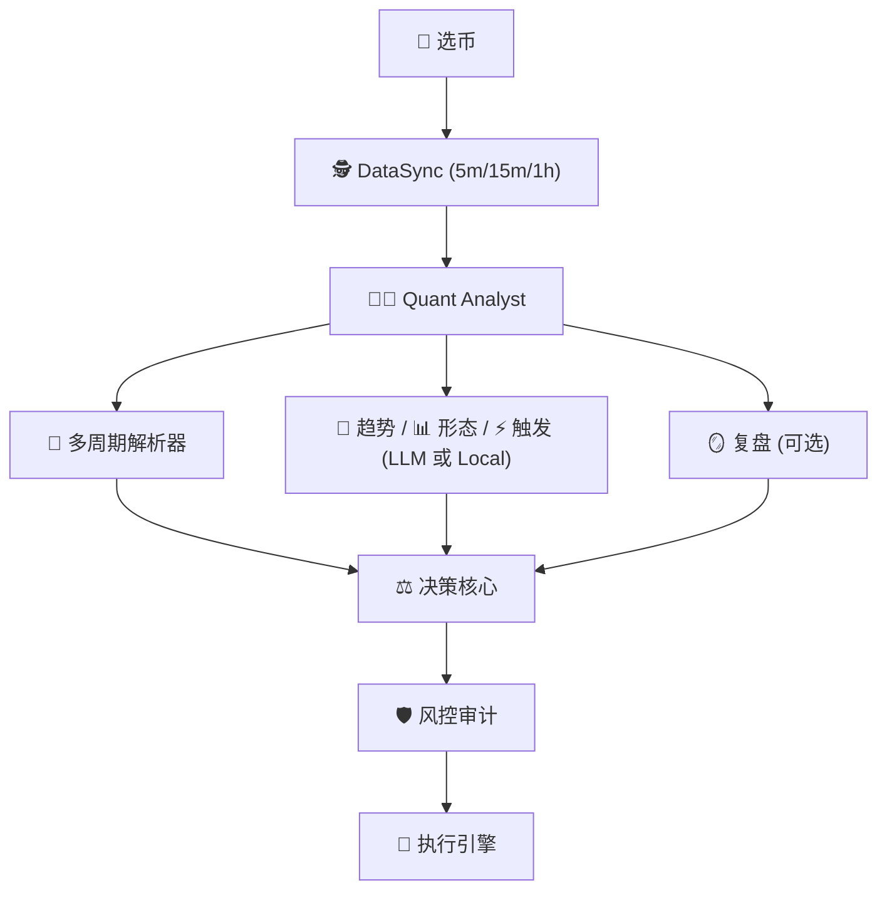

# 🤖 LLM-TradeBot

[](README.md) [](README_CN.md)


基于 **对抗式决策框架 (Adversarial Decision Framework)** 的智能多 Agent 量化交易机器人。通过市场状态检测、价格位置感知、动态评分校准及多层物理审计，实现高胜率、低回撤的自动化合约交易。

[](https://www.python.org/)
[](LICENSE)
[](https://github.com/EthanAlgoX/LLM-TradeBot)

---

## 🌐 网页在线版 (优先推荐)

**无需部署，直接通过网页端监控和管理您的机器人：**
**[👉 立即访问在线仪表盘](https://llm-tradebot.up.railway.app/)**

### 仪表盘亮点

- **LLM 开关** 默认关闭，开启时会提示输入 API Key。
- **Agent Chatroom** 以聊天形式展示每个周期的 Agent 输出与最终决策。
- **实时资金曲线** 使用固定初始资金，并基于订单盈亏更新余额。
- **Agent 配置** 支持为每个 Agent 编辑参数与（可选）系统提示词。

---

## ✨ 核心特性

- 🕵️ **感知优先**: 不同于常规指标派，系统优先判断“当前能不能打”，再判断“怎么打”。
- 🤖 **多 Agent 协作**: 核心 + 可选 Agent 组合，支持 LLM 与 Local 双模式部署。
- 🎛️ **Agent 配置**: 通过仪表盘、环境变量或配置文件启用/禁用可选 Agent，定制化策略。
- 💬 **Agent Chatroom**: 聊天式多 Agent 输出，每周期汇总并由 Decision Core 做最终决策。
- 🧩 **Agent 配置面板**: 在仪表盘中为每个 Agent 配置参数与系统提示词。
- 🎰 **AUTO1 智能选币**: 基于动量、成交量和技术指标自动选择最佳单一交易币种。
- 🧠 **多 LLM 支持**: 无缝切换 DeepSeek、OpenAI、Claude、Qwen、Gemini 等大语言模型。
- ⚡ **异步并发**: 并发获取多周期数据，确保 5m/15m/1h 的数据在同一快照瞬间对齐。
- 🧪💰 **测试/实盘模式切换**: 快速切换模拟交易和实盘交易，可视化确认。
- 🛡️ **安全至上**: 止损方向修正、资金预演、一票否决机制，为实盘交易保驾护航。
- 📊 **全链路审计**: 每一个决策背后的对抗过程、信心惩罚细节均完整记录，实现真正的“白盒化”决策。

---

## 🤝 支持的生态系统

### 支持的交易所

#### CEX (中心化交易所)

| 交易所 | 状态 | 注册 (手续费优惠) |
|----------|--------|-------------------------|
| **Binance** | ✅ 已支持 | [注册账号](https://www.binance.com/join?ref=NOFXENG) |
| **Bybit** | 🗓️ 计划中 | [注册账号](https://partner.bybit.com/b/83856) |
| **OKX** | 🗓️ 计划中 | [注册账号](https://www.okx.com/join/1865360) |
| **Bitget** | 🗓️ 计划中 | [注册账号](https://www.bitget.com/referral/register?from=referral&clacCode=c8a43172) |

#### Perp-DEX (去中心化合约交易所)

| 交易所 | 状态 | 注册 (手续费优惠) |
|----------|--------|-------------------------|
| **Hyperliquid** | 🗓️ 计划中 | [注册账号](https://app.hyperliquid.xyz/join/AITRADING) |
| **Aster DEX** | 🗓️ 计划中 | [注册账号](https://www.asterdex.com/en/referral/fdfc0e) |
| **Lighter** | 🗓️ 计划中 | [注册账号](https://app.lighter.xyz/?referral=68151432) |

### 支持的 AI 模型

| AI 模型 | 状态 | 获取 API Key |
|----------|--------|-------------|
| **DeepSeek** | ✅ 已支持 | [获取 API Key](https://platform.deepseek.com) |
| **Qwen** | ✅ 已支持 | [获取 API Key](https://dashscope.console.aliyun.com) |
| **OpenAI (GPT)** | ✅ 已支持 | [获取 API Key](https://platform.openai.com) |
| **Claude** | ✅ 已支持 | [获取 API Key](https://console.anthropic.com) |
| **Gemini** | ✅ 已支持 | [获取 API Key](https://aistudio.google.com) |
| **Grok** | 🗓️ 计划中 | [获取 API Key](https://console.x.ai) |
| **Kimi** | 🗓️ 计划中 | [获取 API Key](https://platform.moonshot.cn) |

---

## 🚀 快速开始

### 详细步骤

#### 1. 安装依赖

```bash
pip install -r requirements.txt
```

#### 2. 配置环境

```bash
# 复制环境变量模板
cp .env.example .env

# 设置 API 密钥
./set_api_keys.sh
```

#### 3. 配置交易参数

```bash
# 复制配置文件模板
cp config.example.yaml config.yaml
```

编辑 `config.yaml` 设置交易参数：

- 交易对 (symbol)
- 最大仓位 (max_position_size)
- 杠杆倍数 (leverage)
- 止损止盈比例 (stop_loss_pct, take_profit_pct)

### 🧠 LLM 配置 (多提供商支持)

本机器人支持 **5 种 LLM 提供商**，可通过环境变量或仪表盘设置进行配置：

#### 支持的提供商

| 提供商 | 模型 | 成本 | 速度 | 获取 API Key |
|--------|------|------|------|--------------|
| **DeepSeek** (推荐) | deepseek-chat | 💰 低 | ⚡ 快 | [platform.deepseek.com](https://platform.deepseek.com) |
| **OpenAI** | gpt-4o, gpt-4o-mini | 💰💰💰 高 | ⚡ 快 | [platform.openai.com](https://platform.openai.com) |
| **Claude** | claude-3-5-sonnet | 💰💰 中 | ⚡ 快 | [console.anthropic.com](https://console.anthropic.com) |
| **通义千问** | qwen-turbo, qwen-plus | 💰 低 | ⚡ 快 | [dashscope.console.aliyun.com](https://dashscope.console.aliyun.com) |
| **Gemini** | gemini-1.5-pro | 💰 低 | ⚡ 快 | [aistudio.google.com](https://aistudio.google.com) |

#### 配置方法

**方法 1：环境变量** (推荐)

编辑 `.env` 文件：

```bash
# 选择 LLM 提供商 (必填)
LLM_PROVIDER=deepseek  # 可选: deepseek, openai, claude, qwen, gemini

# 配置对应提供商的 API Key
DEEPSEEK_API_KEY=sk-xxx     # 使用 DeepSeek 时
OPENAI_API_KEY=sk-xxx       # 使用 OpenAI 时
CLAUDE_API_KEY=sk-xxx       # 使用 Claude 时
QWEN_API_KEY=sk-xxx         # 使用通义千问时
GEMINI_API_KEY=xxx          # 使用 Gemini 时
```

**方法 2：仪表盘设置**

1. 打开仪表盘 `http://localhost:8000`
2. 点击 **⚙️ 设置** → **API Keys** 选项卡
3. 选择 LLM 提供商并输入 API Key
4. 点击 **保存** - 下一交易周期生效

#### 4. 启动 Web 仪表盘 (推荐)


本项目内置现代化的实时监控仪表盘 (Web Dashboard)。

```bash
# 启动主程序 (自动开启 Web 服务)
python main.py --mode continuous
```

启动后,请在浏览器访问: **<http://localhost:8000>** (或使用我们的 [云端在线版](https://llm-tradebot.up.railway.app/))

> **默认密码**: `admin`

**仪表盘功能**:

- **🧪💰 测试/实盘模式切换**: 快速切换模拟交易和实盘交易，可视化确认
- **📈 K 线图**: TradingView 轻量图表集成，实时 K 线更新，自动同步当前交易币种
- **💰 账户摘要面板**: 实时显示钱包余额、可用余额、权益、初始资金、盈亏及持仓详情
- **🤖 多 Agent 决策框架**: 可视化流程图展示 15 个 Agent 的分层架构
- **🎛️ Agent 选择面板**: 通过设置 → Agents 选项卡配置可选 Agent
- **📡 Agent 活动订阅**: 实时事件流显示 Agent 状态更新
- **📜 交易历史**: 所有交易记录及盈亏统计
- **📋 实时日志输出**: 实时滚动日志，Agent 文档侧边栏，简化/详细模式切换

#### 5. 简化版 CLI 模式 (实盘交易)

**对于生产环境的实盘交易**，推荐使用简化版 CLI 脚本，跳过非必要组件：

```bash
# 首先激活虚拟环境
source venv/bin/activate

# 测试模式 - 单次运行
python simple_cli.py --mode once

# 测试模式 - 持续运行 (3分钟间隔)
python simple_cli.py --mode continuous --interval 3

# 实盘模式 - 持续交易 (⚠️ 真实资金)
python simple_cli.py --mode continuous --interval 3 --live

# 自定义币种 (覆盖 .env 配置)
python simple_cli.py --mode continuous --symbols BTCUSDT,ETHUSDT --live

# AUTO3 模式 - 自动选币
python simple_cli.py --mode continuous --symbols AUTO3 --live
```

**功能特性**:

- ✅ **最小化占用** - 仅加载核心交易组件
- ✅ **生产就绪** - 专为稳定的 24/7 运行设计
- ✅ **AUTO3 支持** - 基于回测的自动最佳币种选择
- ✅ **LLM 集成** - 完整的多 Agent 决策系统
- ✅ **风险管理** - 内置风控审计和仓位限制
- ✅ **优雅退出** - Ctrl+C 安全退出

**配置说明**:

脚本默认从 `.env` 文件读取交易币种：

```bash
# 在 .env 文件中配置
TRADING_SYMBOLS=BTCUSDT,ETHUSDT
# 或使用 AUTO3 自动选择
TRADING_SYMBOLS=AUTO3
```

**⚠️ 实盘交易前提条件**:

- `.env` 中配置有效的币安合约 API 密钥
- 合约钱包中有足够的 USDT 余额
- API 权限：读取 + 合约交易已启用
- DeepSeek/OpenAI API 密钥用于 LLM 决策

---

## 📁 项目结构

### 目录说明

```text
LLM-TradeBot/
├── src/                    # 核心源代码
│   ├── agents/            # 多 Agent 定义 (DataSync, Quant, Decision, Risk)
│   ├── api/               # Binance API 客户端
│   ├── data/              # 数据处理模块 (processor, validator)
│   ├── execution/         # 交易执行引擎
│   ├── features/          # 特征工程模块
│   ├── monitoring/        # 监控和日志
│   ├── risk/              # 风险管理
│   ├── strategy/          # LLM 决策引擎
│   └── utils/             # 工具函数 (DataSaver, TradeLogger 等)
│
├── docs/                  # 项目文档
│   ├── data_flow_analysis.md          # 数据流转分析文档
│   ├── ScreenShot_2026-01-21_003126_160.png # 仪表盘截图
│   └── Backtesting.png                # 回测界面
│
├── data/                  # 结构化数据存储 (按日期归档)
│   ├── market_data/       # 原始 K 线数据
│   ├── indicators/        # 技术指标
│   ├── features/          # 特征快照
│   ├── decisions/         # 决策结果
│   └── execution/         # 执行记录
│
├── logs/                  # 系统运行日志
├── tests/                 # 单元测试
├── config/                # 配置文件
│
├── main.py                # 统一程序入口 (Multi-Agent 循环)
├── config.yaml            # 交易参数配置
├── .env                   # API 密钥配置
└── requirements.txt       # Python 依赖
```

---

## 🎯 核心架构

### 多 Agent 协作 + 四层策略过滤



**设计要点**
1. **选币** 在分析前确定当前交易对象。
2. **DataSync** 对齐 5m/15m/1h 多周期数据快照。
3. **Quant Analyst** 输出趋势/震荡/情绪/陷阱等数值信号。
4. **语义代理**（趋势/形态/触发）提供可读结论（LLM 或 Local）。
5. **多周期解析器** 将对齐信息压缩成决策输入。
6. **决策核心** 融合所有启用代理输出并给出动作/置信度。
7. **风控审计** 可否决或修正。
8. **复盘** 汇总交易表现，作为后续决策参考。

> 📖 **详细文档**: 查看 [数据流转分析文档](./docs/data_flow_analysis.md) 了解完整的数据流转机制。

## 📄 数据全链路审计

### 存储组织

系统自动将每一循环的中间过程记录在 `data/` 目录下，按日期组织，方便复盘和调试：

```text
data/
├── market_data/           # 原始多周期 K 线
│   └── {date}/
│       ├── BTCUSDT_5m_{timestamp}.json
│       ├── BTCUSDT_5m_{timestamp}.csv
│       ├── BTCUSDT_5m_{timestamp}.parquet
│       ├── BTCUSDT_15m_{timestamp}.json
│       └── BTCUSDT_1h_{timestamp}.json
│
├── indicators/            # 全量技术指标 DataFrames
│   └── {date}/
│       ├── BTCUSDT_5m_{snapshot_id}.parquet
│       ├── BTCUSDT_15m_{snapshot_id}.parquet
│       └── BTCUSDT_1h_{snapshot_id}.parquet
│
├── features/              # 提取的特征快照
│   └── {date}/
│       ├── BTCUSDT_5m_{snapshot_id}_v1.parquet
│       ├── BTCUSDT_15m_{snapshot_id}_v1.parquet
│       └── BTCUSDT_1h_{snapshot_id}_v1.parquet
│
├── context/               # 量化分析摘要
│   └── {date}/
│       └── BTCUSDT_quant_analysis_{snapshot_id}.json
│
├── llm_logs/              # LLM 输入上下文及 voting 过程
│   └── {date}/
│       └── BTCUSDT_{snapshot_id}.md
│
├── decisions/             # 最终加权投票结果
│   └── {date}/
│       └── BTCUSDT_{snapshot_id}.json
│
└── execution/             # 执行追踪
    └── {date}/
        └── BTCUSDT_{timestamp}.json
```

### 数据格式

- **JSON**: 可读性强，用于配置和决策结果
- **CSV**: 兼容性好，方便导入 Excel 分析
- **Parquet**: 高效压缩，用于大规模时序数据

---

## 🛡️ 安全提示

⚠️ **重要安全措施**:

1. **API 密钥**: 妥善保管，不要提交到版本控制
2. **测试模式先行**: 使用 `--test` 参数运行模拟交易，验证逻辑后再上实盘
3. **风险控制**: 在 `config.yaml` 中设置合理的止损和仓位限制
4. **权限最小化**: 为 API 密钥仅分配必要的合约交易权限
5. **监控告警**: 定期检查 `logs/` 目录，关注异常情况

---

## 📚 文档导航

| 文档 | 说明 |
|------|------|
| [README.md](./README.md) | 项目概览和快速开始 |
| [数据流转分析](./docs/data_flow_analysis.md) | 完整的数据流转机制和技术细节 |
| [API 密钥指南](./docs/API_KEYS_GUIDE.txt) | API 密钥配置说明 |
| [配置示例](./config.example.yaml) | 交易参数配置模板 |
| [环境变量示例](./.env.example) | 环境变量配置模板 |

---

## 🎉 最新更新

**2026-02-07**:

- ✅ **多 Agent Chatroom**：每周期输出各 Agent 结果与最终决策。
- ✅ **Agent 配置页**：按 Agent 配置参数与（可选）系统提示词。
- ✅ **LLM 开关（默认关闭）**：仅在输入 API Key 后启用调用。
- ✅ **多周期解析器**：1h/15m/5m 对齐信息摘要输入决策核心。
- ✅ **余额/盈亏修正**：初始资金固定，当前余额由 PnL 驱动。

**2026-01-07**:

- ✅ **AUTO3 动态选币系统**: 新增 `SymbolSelectorAgent` 自动选择最佳交易币种。
  - 获取 AI500 按 24h 交易量排名的 Top 5 币种
  - 对每个币种运行 24h 回测
  - 按综合评分排序: 收益率 (30%) + 夏普比率 (20%) + 胜率 (25%) + 回撑 (15%) + 交易频率 (10%)
  - 自动选择 Top 2 表现最优的币种，12 小时缓存自动刷新
- ✅ **回测/实盘环境一致性**: `BacktestAgentRunner` 完全匹配实盘交易环境。
  - 风控审计 Agent 集成到回测流程
  - 四层策略过滤在回测中启用
  - 仟位分析和市场状态检测启用
- ✅ **增强的回测 CLI**: `python backtest.py` 支持：
  - 多币种回测
  - Agent 策略模式 (`--strategy-mode agent`)
  - LLM 增强选项 (`--use-llm`)
  - 详细的 HTML 报告和权益曲线

**2025-12-31**:

- ✅ **全中文国际化 (i18n)**: 完整的中英文双语支持，一键切换语言。

**2025-12-28**:

- ✅ **Dashboard 日志模式切换**: 支持简化模式和详细模式切换。
- ✅ **净值曲线增强**: 智能 x 轴标签自适应数据量。

**2025-12-25**:

- ✅ **ReflectionAgent (哲学家)**: 新增交易反思 Agent，分析每 10 笔交易并提供改进建议。

**2025-12-24**:

- ✅ **多 LLM 支持**: 新增 5 种 LLM 提供商支持 (DeepSeek, OpenAI, Claude, Qwen, Gemini)。
- ✅ **多账户架构**: 新增 `src/exchanges/` 模块支持多交易所账户。

**2025-12-20**:

- ✅ **对抗式决策框架**: 引入 `PositionAnalyzer` 和 `RegimeDetector`，实现环境感知的对抗决策。
- ✅ **信心评分重构**: 实现动态信心惩罚机制，大幅降低震荡市误开仓率。
- ✅ **全链路审计**: 实现从数据采集到决策执行的完整中间态归档。

---

## 🤝 贡献

欢迎提交 Issue 和 Pull Request！

---

本项目采用 MIT License 许可证。详见 [LICENSE](LICENSE) 文件。

---

**由 AI 赋能，专注精准决策，开启智能量化新征程！** 🚀
