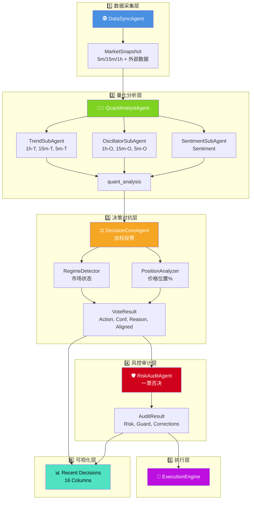

# 🤖 LLM-TradeBot

[](README.md) [](README_CN.md)


基于 **对抗式决策框架 (Adversarial Decision Framework)** 的智能多 Agent 量化交易机器人。通过市场状态检测、价格位置感知、动态评分校准及多层物理审计，实现高胜率、低回撤的自动化合约交易。

[](https://www.python.org/)
[](LICENSE)
[](https://github.com/EthanAlgoX/LLM-TradeBot)

---

## 🌐 网页在线版 (优先推荐)

**无需部署，直接通过网页端监控和管理您的机器人：**
**[👉 立即访问在线仪表盘](https://llm-tradebot.up.railway.app/)**

---

## ✨ 核心特性

- 🕵️ **感知优先**: 不同于常规指标派，系统优先判断“当前能不能打”，再判断“怎么打”。
- 🤖 **Multi-Agent 协作**: 13 个高度专业化的 Agent 独立运行，形成对抗验证链条。
- 🔝 **AUTO3 动态选币**: 基于 24h 回测结果自动选择最佳交易币种 - AI 自动挑选最优资产。
- 🧠 **多 LLM 支持**: 无缝切换 DeepSeek、OpenAI、Claude、Qwen、Gemini 等大语言模型。
- ⚡ **异步并发**: 并发获取多周期数据，确保 5m/15m/1h 的数据在同一快照瞬间对齐。
- 🛡️ **安全至上**: 止损方向修正、资金预演、一票否决机制，为实盘交易保驾护航。
- 📊 **全链路审计**: 每一个决策背后的对抗过程、信心惩罚细节均完整记录，实现真正的“白盒化”决策。

---

## 🤝 支持的生态系统

### 支持的交易所

#### CEX (中心化交易所)

| 交易所 | 状态 | 注册 (手续费优惠) |
|----------|--------|-------------------------|
| **Binance** | ✅ 已支持 | [注册账号](https://www.binance.com/join?ref=NOFXENG) |
| **Bybit** | 🗓️ 计划中 | [注册账号](https://partner.bybit.com/b/83856) |
| **OKX** | 🗓️ 计划中 | [注册账号](https://www.okx.com/join/1865360) |
| **Bitget** | 🗓️ 计划中 | [注册账号](https://www.bitget.com/referral/register?from=referral&clacCode=c8a43172) |

#### Perp-DEX (去中心化合约交易所)

| 交易所 | 状态 | 注册 (手续费优惠) |
|----------|--------|-------------------------|
| **Hyperliquid** | 🗓️ 计划中 | [注册账号](https://app.hyperliquid.xyz/join/AITRADING) |
| **Aster DEX** | 🗓️ 计划中 | [注册账号](https://www.asterdex.com/en/referral/fdfc0e) |
| **Lighter** | 🗓️ 计划中 | [注册账号](https://app.lighter.xyz/?referral=68151432) |

### 支持的 AI 模型

| AI 模型 | 状态 | 获取 API Key |
|----------|--------|-------------|
| **DeepSeek** | ✅ 已支持 | [获取 API Key](https://platform.deepseek.com) |
| **Qwen** | ✅ 已支持 | [获取 API Key](https://dashscope.console.aliyun.com) |
| **OpenAI (GPT)** | ✅ 已支持 | [获取 API Key](https://platform.openai.com) |
| **Claude** | ✅ 已支持 | [获取 API Key](https://console.anthropic.com) |
| **Gemini** | ✅ 已支持 | [获取 API Key](https://aistudio.google.com) |
| **Grok** | 🗓️ 计划中 | [获取 API Key](https://console.x.ai) |
| **Kimi** | 🗓️ 计划中 | [获取 API Key](https://platform.moonshot.cn) |

---

## 🚀 快速开始

### 启动流程


### 详细步骤

#### 1. 安装依赖

```bash
pip install -r requirements.txt
```

#### 2. 配置环境

```bash
# 复制环境变量模板
cp .env.example .env

# 设置 API 密钥
./set_api_keys.sh
```

#### 3. 配置交易参数

```bash
# 复制配置文件模板
cp config.example.yaml config.yaml
```

编辑 `config.yaml` 设置交易参数：

- 交易对 (symbol)
- 最大仓位 (max_position_size)
- 杠杆倍数 (leverage)
- 止损止盈比例 (stop_loss_pct, take_profit_pct)

#### 4. 启动 Web 仪表盘 (推荐)


本项目内置现代化的实时监控仪表盘 (Web Dashboard)。

```bash
# 启动主程序 (自动开启 Web 服务)
python main.py --mode continuous
```

启动后,请在浏览器访问: **<http://localhost:8000>** (或使用我们的 [云端在线版](https://llm-tradebot.up.railway.app/))

> **默认密码**: `admin`

**仪表盘功能**:

- **📉 实时 K 线**: 集成 TradingView 组件，1分钟级实时刷新
- **📈 净值曲线**: 实时账户权益变化追踪
- **📋 决策审计**: 完整的历史决策记录,包含 Agents 详细评分 (Strategist, Trend, Oscillator, Sentiment)
- **📜 交易历史**: 所有交易记录及盈亏统计
- **📡 Live Log Output**: 实时滚动日志，支持 Agent 标签高亮显示 (Oracle, Strategist, Critic, Guardian)，500行容量历史回溯

#### 5. 简化版 CLI 模式 (实盘交易)

**对于生产环境的实盘交易**，推荐使用简化版 CLI 脚本，跳过非必要组件：

```bash
# 首先激活虚拟环境
source venv/bin/activate

# 测试模式 - 单次运行
python simple_cli.py --mode once

# 测试模式 - 持续运行 (3分钟间隔)
python simple_cli.py --mode continuous --interval 3

# 实盘模式 - 持续交易 (⚠️ 真实资金)
python simple_cli.py --mode continuous --interval 3 --live

# 自定义币种 (覆盖 .env 配置)
python simple_cli.py --mode continuous --symbols BTCUSDT,ETHUSDT --live

# AUTO3 模式 - 自动选币
python simple_cli.py --mode continuous --symbols AUTO3 --live
```

**功能特性**:

- ✅ **最小化占用** - 仅加载核心交易组件
- ✅ **生产就绪** - 专为稳定的 24/7 运行设计
- ✅ **AUTO3 支持** - 基于回测的自动最佳币种选择
- ✅ **LLM 集成** - 完整的多 Agent 决策系统
- ✅ **风险管理** - 内置风控审计和仓位限制
- ✅ **优雅退出** - Ctrl+C 安全退出

**配置说明**:

脚本默认从 `.env` 文件读取交易币种：

```bash
# 在 .env 文件中配置
TRADING_SYMBOLS=BTCUSDT,ETHUSDT
# 或使用 AUTO3 自动选择
TRADING_SYMBOLS=AUTO3
```

**⚠️ 实盘交易前提条件**:

- `.env` 中配置有效的币安合约 API 密钥
- 合约钱包中有足够的 USDT 余额
- API 权限：读取 + 合约交易已启用
- DeepSeek/OpenAI API 密钥用于 LLM 决策

---

## 📁 项目结构

### 目录树形图


### 目录说明

```text
LLM-TradeBot/
├── src/                    # 核心源代码
│   ├── agents/            # 多 Agent 定义 (DataSync, Quant, Decision, Risk)
│   ├── api/               # Binance API 客户端
│   ├── data/              # 数据处理模块 (processor, validator)
│   ├── execution/         # 交易执行引擎
│   ├── features/          # 特征工程模块
│   ├── monitoring/        # 监控和日志
│   ├── risk/              # 风险管理
│   ├── strategy/          # LLM 决策引擎
│   └── utils/             # 工具函数 (DataSaver, TradeLogger 等)
│
├── docs/                  # 项目文档
│   ├── data_flow_analysis.md          # 数据流转分析文档
│   └── *.png                          # 架构图和流程图
│
├── data/                  # 结构化数据存储 (按日期归档)
│   ├── market_data/       # 原始 K 线数据
│   ├── indicators/        # 技术指标
│   ├── features/          # 特征快照
│   ├── decisions/         # 决策结果
│   └── execution/         # 执行记录
│
├── logs/                  # 系统运行日志
├── tests/                 # 单元测试
├── config/                # 配置文件
│
├── main.py                # 统一程序入口 (Multi-Agent 循环)
├── config.yaml            # 交易参数配置
├── .env                   # API 密钥配置
└── requirements.txt       # Python 依赖
```

---

## 🎯 核心架构

### 13-Agent 协作框架 + 四层策略过滤

本系统采用 **四层策略过滤 (Four-Layer Strategy)** 架构，结合 13 个专业化 Agent 协作完成交易决策：

#### 币种选择层 Agents

| Agent | 角色 | 职责 |
|-------|------|------|
| **🔝 SymbolSelectorAgent** | AUTO3 Selector | 基于回测的动态币种选择，从 AI500 Top 5 自动筛选 Top 2 最佳交易币种 |

#### 数据层 Agents

| Agent | 角色 | 职责 |
|-------|------|------|
| **🕵️ DataSyncAgent** | The Oracle | 异步并发采集 5m/15m/1h K线数据，确保市场快照一致性 |
| **👨‍🔬 QuantAnalystAgent** | The Strategist | 生成趋势评分、震荡指标、情绪分析及 OI Fuel |

#### 预测层 Agents

| Agent | 角色 | 职责 |
|-------|------|------|
| **🔮 PredictAgent** | The Prophet | 基于技术特征预测价格上涨概率 (Rule-based/ML) |
| **🎯 RegimeDetector** | Regime Analyzer | 检测市场状态 (趋势/震荡) 及 ADX 强度 |
| **🤖 AIFilter** | AI Validator | AI 预测与趋势方向一致性验证，拥有否决权 |

#### 语义分析层 Agents (LLM 上下文生成)

| Agent | 角色 | 职责 |
|-------|------|------|
| **📈 TrendAgent** | Trend Summarizer | 生成趋势方向语义分析 (UPTREND/DOWNTREND) |
| **📊 SetupAgent** | Setup Analyzer | 生成入场位置语义分析 (PULLBACK_ZONE/OVERBOUGHT) |
| **⚡ TriggerAgent** | Trigger Reporter | 生成触发信号语义分析 (CONFIRMED/WAITING) |

#### 决策与执行层 Agents

| Agent | 角色 | 职责 |
|-------|------|------|
| **🧠 StrategyEngine** | LLM Decision | DeepSeek LLM 多空辩论决策引擎 |
| **👮 RiskAuditAgent** | The Guardian | 风控审计，拥有一票否决权 |
| **🧠 ReflectionAgent** | The Philosopher | 交易反思，为 LLM 提供历史教训 |
| **🚀 ExecutionEngine** | The Executor | 精准执行订单及状态管理 |

### 四层策略过滤 (Four-Layer Strategy)

```text
Layer 1: Trend + Fuel (1h EMA + Volume Proxy)
    ↓ PASS/FAIL
Layer 2: AI Filter (PredictAgent 方向一致性验证)
    ↓ PASS/VETO
Layer 3: Setup (15m KDJ + Bollinger Bands 入场位置)
    ↓ READY/WAIT
Layer 4: Trigger (5m 形态 + RVOL 放量确认)
    ↓ CONFIRMED/WAITING
    ↓
🧠 LLM Decision (DeepSeek 多空辩论)
    ↓
👮 Risk Audit (一票否决)
    ↓
🚀 Execution
```

### 数据流转架构


**架构说明**:

1. **数据采集层** (蓝色): DataSyncAgent 异步并发采集多周期数据
2. **量化分析层** (绿色): QuantAnalystAgent 内部 3 个子 Agent 并行分析
3. **决策对抗层** (橙色): DecisionCoreAgent 集成市场感知模块进行加权投票
4. **风控审计层** (红色): RiskAuditAgent 执行最终审核和自动修正
5. **执行层** (紫色): ExecutionEngine 执行订单
6. **可视化层**: Recent Decisions 表格完整展示所有 Agent 数据 (16列)

#### 详细流程图



> 📖 **详细文档**: 查看 [数据流转分析文档](./docs/data_flow_analysis.md) 了解完整的数据流转机制，或查看 [多Agent技术详解](./README_MULTI_AGENT.md) 了解底层实现细节。

---

## 📄 数据全链路审计

### 数据存储结构


### 存储组织

系统自动将每一循环的中间过程记录在 `data/` 目录下，按日期组织，方便复盘和调试：

```text
data/
├── market_data/           # 原始多周期 K 线
│   └── {date}/
│       ├── BTCUSDT_5m_{timestamp}.json
│       ├── BTCUSDT_5m_{timestamp}.csv
│       ├── BTCUSDT_5m_{timestamp}.parquet
│       ├── BTCUSDT_15m_{timestamp}.json
│       └── BTCUSDT_1h_{timestamp}.json
│
├── indicators/            # 全量技术指标 DataFrames
│   └── {date}/
│       ├── BTCUSDT_5m_{snapshot_id}.parquet
│       ├── BTCUSDT_15m_{snapshot_id}.parquet
│       └── BTCUSDT_1h_{snapshot_id}.parquet
│
├── features/              # 提取的特征快照
│   └── {date}/
│       ├── BTCUSDT_5m_{snapshot_id}_v1.parquet
│       ├── BTCUSDT_15m_{snapshot_id}_v1.parquet
│       └── BTCUSDT_1h_{snapshot_id}_v1.parquet
│
├── context/               # 量化分析摘要
│   └── {date}/
│       └── BTCUSDT_quant_analysis_{snapshot_id}.json
│
├── llm_logs/              # LLM 输入上下文及 voting 过程
│   └── {date}/
│       └── BTCUSDT_{snapshot_id}.md
│
├── decisions/             # 最终加权投票结果
│   └── {date}/
│       └── BTCUSDT_{snapshot_id}.json
│
└── execution/             # 执行追踪
    └── {date}/
        └── BTCUSDT_{timestamp}.json
```

### 数据格式

- **JSON**: 可读性强，用于配置和决策结果
- **CSV**: 兼容性好，方便导入 Excel 分析
- **Parquet**: 高效压缩，用于大规模时序数据

---

## 🛡️ 安全提示

⚠️ **重要安全措施**:

1. **API 密钥**: 妥善保管，不要提交到版本控制
2. **测试模式先行**: 使用 `--test` 参数运行模拟交易，验证逻辑后再上实盘
3. **风险控制**: 在 `config.yaml` 中设置合理的止损和仓位限制
4. **权限最小化**: 为 API 密钥仅分配必要的合约交易权限
5. **监控告警**: 定期检查 `logs/` 目录，关注异常情况

---

## 📚 文档导航

| 文档 | 说明 |
|------|------|
| [README.md](./README.md) | 项目概览和快速开始 |
| [数据流转分析](./docs/data_flow_analysis.md) | 完整的数据流转机制和技术细节 |
| [API 密钥指南](./docs/API_KEYS_GUIDE.txt) | API 密钥配置说明 |
| [配置示例](./config.example.yaml) | 交易参数配置模板 |
| [环境变量示例](./.env.example) | 环境变量配置模板 |

---

## 🎉 最新更新

**2026-01-07**:

- ✅ **AUTO3 动态选币系统**: 新增 `SymbolSelectorAgent` 自动选择最佳交易币种。
  - 获取 AI500 按 24h 交易量排名的 Top 5 币种
  - 对每个币种运行 24h 回测
  - 按综合评分排序: 收益率 (30%) + 夏普比率 (20%) + 胜率 (25%) + 回撑 (15%) + 交易频率 (10%)
  - 自动选择 Top 2 表现最优的币种，12 小时缓存自动刷新
- ✅ **回测/实盘环境一致性**: `BacktestAgentRunner` 完全匹配实盘交易环境。
  - 风控审计 Agent 集成到回测流程
  - 四层策略过滤在回测中启用
  - 仟位分析和市场状态检测启用
- ✅ **增强的回测 CLI**: `python backtest.py` 支持：
  - 多币种回测
  - Agent 策略模式 (`--strategy-mode agent`)
  - LLM 增强选项 (`--use-llm`)
  - 详细的 HTML 报告和权益曲线

**2025-12-31**:

- ✅ **全中文国际化 (i18n)**: 完整的中英文双语支持，一键切换语言。

**2025-12-28**:

- ✅ **Dashboard 日志模式切换**: 支持简化模式和详细模式切换。
- ✅ **净值曲线增强**: 智能 x 轴标签自适应数据量。

**2025-12-25**:

- ✅ **ReflectionAgent (哲学家)**: 新增交易反思 Agent，分析每 10 笔交易并提供改进建议。

**2025-12-24**:

- ✅ **多 LLM 支持**: 新增 5 种 LLM 提供商支持 (DeepSeek, OpenAI, Claude, Qwen, Gemini)。
- ✅ **多账户架构**: 新增 `src/exchanges/` 模块支持多交易所账户。

**2025-12-20**:

- ✅ **对抗式决策框架**: 引入 `PositionAnalyzer` 和 `RegimeDetector`，实现环境感知的对抗决策。
- ✅ **信心评分重构**: 实现动态信心惩罚机制，大幅降低震荡市误开仓率。
- ✅ **全链路审计**: 实现从数据采集到决策执行的完整中间态归档。

---

## 🤝 贡献

欢迎提交 Issue 和 Pull Request！

---

本项目采用 GNU Affero General Public License v3.0 许可证。详见 [LICENSE](LICENSE) 文件。

---

**由 AI 赋能，专注精准决策，开启智能量化新征程！** 🚀
