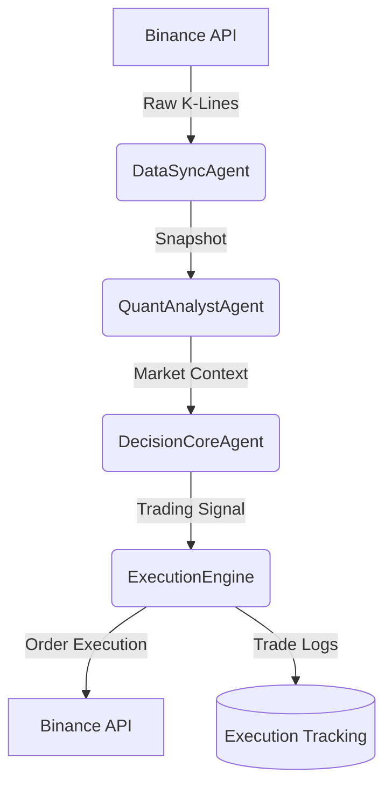

# AI Trader 数据流转全景文档 (Strict Multi-Agent Edition)

**文档版本**: v2.0  
**更新时间**: 2025-12-20  
**架构模式**: 🕵️‍♂️ 严格多Agent协作模式
**系统状态**: ✅ 运行正常

---

## 📋 目录

1. [系统概览](#系统概览)
2. [多Agent协作架构](#多agent协作架构)
3. [数据目录全解析](#数据目录全解析)
4. [核心数据流转流程](#核心数据流转流程)
5. [数据归档与维护](#数据归档与维护)

---

## 🎯 系统概览

本系统采用多Agent协作架构，将交易生命周期拆分为四个核心环节，每个环节由专门的Agent负责执行并产生独立的数据归档。这种结构确保了决策过程的可追溯性和系统的模块化。

---

## 🔄 多Agent协作架构

### 数据流转主轴

---

## 📂 数据目录全解析

所有运行数据均严格按Agent名称存放于 `data/` 目录下：

### 1. `data/data_sync_agent/` (数据同步官)

**职责**: 高效并发获取多周期（5m, 15m, 1h）的市场原始数据。

* **输入**: Binance API 实时K线。
* **归档文件**:
  * `market_data_{Symbol}_{TF}_{Timestamp}.json/csv/parquet`: 包含原始K线数据及时间戳验证。
  * **核心作用**: 为后续分析提供一致的“市场快照”。

### 2. `data/quant_analyst_agent/` (量化分析师)

**职责**: 计算技术指标并构建高维特征。

* **归档子目录**:
  * `indicators/`: 存储 SMA, EMA, MACD, RSI 等计算结果 (Parquet格式)。
  * `features/`: 存储动量、波动率、趋势强度等派生特征。
  * `context/`: 记录生成的“市场上下文 (JSON)”，这是输入给LLM的核心文本。

### 3. `data/decision_core_agent/` (决策中枢)

**职责**: 运用多Agent投票及LLM逻辑生成最终信号。

* **归档子目录**:
  * `decisions/`: 记录每一轮的最终投票结果、各Agent意见及置信度 (JSON)。
  * `llm_logs/`: 记录发送给LLM的完整Prompt及原始Markdown响应 (MD)。

### 4. `data/execution_engine/` (交易执行引擎)

**职责**: 负责订单提交、风控校验及持仓生命周期追踪。

* **归档子目录**:
  * `orders/`: 记录每笔交易的订单参数、成交价格及回报。
  * `tracking/`: 记录 `TradeLogger` 生成的详细日志（开仓/平仓、PnL、每日汇总）。
  * `backtest/`: 记录历史回测结果。

---

## 🔄 核心数据流转流程

### 第一阶段：感知 (Perception)

`DataSyncAgent` 并发拉取 300 根 5m, 15m, 1h K线。数据通过 `DataSaver.save_market_data` 归档。

### 第二阶段：认知 (Cognition)

`QuantAnalystAgent` 计算 80+ 个特征。技术指标快照存入 `quant_analyst_agent/indicators/`，生成的 JSON 上下文存入 `quant_analyst_agent/context/`。

### 第三阶段：决策 (Judgment)

`DecisionCoreAgent` 接收上下文。LLM 实时日志存入 `decision_core_agent/llm_logs/`，最终信号（BUY/SELL/HOLD）存入 `decision_core_agent/decisions/`。

### 第四阶段：行动 (Action)

若信号为买入/卖出，`ExecutionEngine` 执行交易。详细轨迹及每日 PnL 汇总记录在 `execution_engine/tracking/`。

---

## 🛠️ 数据归档与维护

### 存储性能

* **单次循环**: 产生约 5-10 个文件。
* **每日预估**: ~30 MB (全天候运行)。

### 维护建议

1. **定期清理**: 建议每月归档并压缩 30 天前的 `parquet` 和 `json` 文件。
2. **日志轮转**: `logs/multi_agent.log` 记录系统级异常，应结合 `data/` 下的文件进行复盘。

---

## 📞 版本历史

* **v2.0 (2025-12-20)**: 全面适配 Strict Multi-Agent 架构，移除旧版 Step1-9 路径描述。
